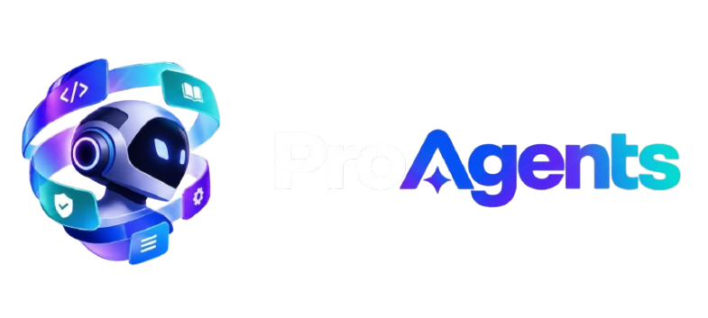

<div align="center">



**Forge professional AI agents from existing coding agents.**

An open-source, agentic CLI + Agent Skill that **equips existing coding-agent harnesses with professional expertise, methods, skills, rules, tools, knowledge, and verification practices.**

ProAgents does not replace Claude Code, Codex, OpenCode, Gemini CLI, Cursor, or other coding-agent harnesses.

**It gives them a profession.**

```text
Existing Coding Agent
        +
Professional Agent Profile
        ↓
Professional Agent
```

```text
Intelligence
     +
Professional Profile
     ├── Expertise
     ├── Knowledge
     ├── Methods
     ├── Skills
     ├── Rules
     ├── Policies
     ├── Tools
     └── Verification
        ↓
Existing Harness
        ↓
Professional Agent
```

`npm i -g proagent` · [Documentation](https://proagents.reposell.dev/) · [Registry](https://proagents.reposell.dev/) · MIT

[](https://github.com/sponsors/EnzoVezzaro)

[](https://ko-fi.com/enzojuniorvezzaro)

[](https://buy.stripe.com/6oU6oI4XIdDs80t6701Nu02)

<div style="font-family: -apple-system, BlinkMacSystemFont, &quot;Segoe UI&quot;, Roboto, &quot;Helvetica Neue&quot;, Arial, sans-serif; border: 1px solid rgb(224, 224, 224); border-radius: 12px; padding: 20px; max-width: 500px; margin: 20px auto 0; background: rgb(255, 255, 255); box-shadow: rgba(0, 0, 0, 0.05) 0px 2px 8px;"><div style="display: flex; align-items: center; gap: 12px; margin-bottom: 12px;"><div style="flex: 1 1 0%; min-width: 0px;"><h3 style="margin: 0px; font-size: 18px; font-weight: 600; color: rgb(26, 26, 26); line-height: 1.3; overflow: hidden; text-overflow: ellipsis; white-space: nowrap;">ProAgents</h3><p style="margin: 4px 0px 0px; font-size: 14px; color: rgb(102, 102, 102); line-height: 1.4; overflow: hidden; text-overflow: ellipsis; display: -webkit-box; -webkit-line-clamp: 2; -webkit-box-orient: vertical;">Give your coding agent a profession.</p></div></div><a href="https://www.producthunt.com/products/proagents?embed=true&amp;utm_source=embed&amp;utm_medium=post_embed" target="_blank" rel="noopener" style="display: inline-flex; align-items: center; gap: 4px; margin-top: 12px; padding: 8px 16px; background: rgb(255, 97, 84); color: rgb(255, 255, 255); text-decoration: none; border-radius: 9999px; font-size: 16px; font-weight: 600; line-height: 1.5;">Check it out on Product Hunt →</a></div>

</div>

---

## What is ProAgents?

Modern coding agents already have powerful intelligence, tools, terminals, filesystems, MCP, and execution environments.

What they often lack is a **professional operating model**.

A generic coding agent can write code.

A professional agent should know **how a professional in a particular discipline approaches the work**.

ProAgents introduces a portable abstraction:

## Professional Agent Profile

A Professional Agent Profile defines the professional layer an agent operates under:

```text
Professional Profile
│
├── Identity
├── Expertise
├── Knowledge
├── Methods
├── Skills
├── Rules
├── Policies
├── Standards
├── Tool requirements
└── Verification
```

A profile is not simply a prompt.

It is a structured, composable and versioned definition of **how an agent should operate within a profession**.

For example:

```bash
proagent equip security-engineer
```

can equip an existing coding agent with:

```text
Security Engineering
├── Threat modeling
├── Attack-surface analysis
├── Secure coding practices
├── Security testing
├── OWASP knowledge
├── Security-specific skills
├── Security rules
└── Security verification
```

The underlying model does not change.

**The agent's professional capabilities and operating discipline do.**

---

## The Architecture

ProAgents sits above existing coding-agent harnesses.

```text
                       HUMAN
                         │
                         ▼
                    PROAGENTS
                         │
                         ▼
              PROFESSIONAL PROFILE
                         │
        ┌────────────────┼────────────────┐
        ▼                ▼                ▼
    KNOWLEDGE          METHODS           RULES
        │                │                │
        └────────────────┼────────────────┘
                         ▼
                       SKILLS
                         │
                       TOOLS
                         │
                   VERIFICATION
                         │
                         ▼
                 PROFILE COMPILER
                         │
          ┌──────────────┼──────────────┐
          ▼              ▼              ▼
     Claude Code       Codex        OpenCode
          │              │              │
          └──────────────┼──────────────┘
                         ▼
                  CODING AGENT
```

ProAgents is therefore **not another coding-agent harness**.

It is the **professional layer that can be worn by different harnesses**.

---

## Why?

Today's coding agents are increasingly capable of reasoning, using tools, modifying repositories, running tests and coordinating work.

But capability is not the same thing as professional practice.

A generic agent might approach:

```text
"Find the authentication vulnerability."
```

as:

```text
read code → make change → run tests → done
```

A security-engineering profile can establish a professional workflow:

```text
Understand security boundary
        ↓
Reproduce the issue
        ↓
Identify attack surface
        ↓
Threat-model the vulnerability
        ↓
Determine root cause
        ↓
Assess impact
        ↓
Implement remediation
        ↓
Add regression coverage
        ↓
Run security verification
        ↓
Review adjacent attack surfaces
        ↓
Report evidence
```

The difference is not simply more context.

It is **professional methodology + constraints + capabilities + verification**.

---

## Intelligence + Profile

ProAgents separates the model from the professional layer.

```text
                  AGENT
                    │
          ┌─────────┴─────────┐
          ▼                   ▼
    INTELLIGENCE           PROFILE
          │                   │
       Model          ┌───────┼────────┐
                      ▼       ▼        ▼
                  Knowledge Methods  Rules
                      │       │        │
                      └───────┼────────┘
                              ▼
                            Skills
                              │
                            Tools
                              │
                        Verification
```

**Intelligence** provides reasoning.

**Tools** provide capabilities.

**Skills** provide reusable procedures.

**Knowledge** provides reference material.

**Methods** provide professional approaches to solving problems.

**Rules and policies** establish constraints.

**Verification** establishes evidence that work is correct.

**The Professional Profile composes these into a coherent professional agent.**

---

## Professional Profiles

Profiles are the core ProAgents primitive.

Examples:

```text
senior-engineer
staff-engineer
principal-engineer
backend-engineer
frontend-engineer
security-engineer
performance-engineer
database-engineer
devops-engineer
sre
qa-engineer
accessibility-engineer
systems-architect
```

A profile can contain:

```json
{
  "schema": "proagents/profile/v1",
  "version": "1.1.0",

  "profile": {
    "name": "Security Engineer",
    "slug": "security-engineer",
    "description": "Application security: threat modeling, secure coding, security verification.",
    "author": "proagents",
    "tags": ["security", "owasp", "threat-modeling"]
  },

  "identity": "identity.json",

  "expertise": [
    "expertise/01-application-security.json",
    "expertise/02-threat-modeling.json"
  ],

  "knowledge": [
    "knowledge/owasp.json",
    "knowledge/authentication.json"
  ],

  "methods": [
    "methods/01-threat-modeling.json",
    "methods/02-root-cause-analysis.json"
  ],

  "skills": [
    "skills/01-security-audit.json"
  ],

  "rules": [
    "rules/01-never-expose-secrets.json",
    "rules/02-require-security-verification.json"
  ],

  "standards": [
    "standards/01-owasp.json"
  ],

  "tools": "tools/requirements.json",

  "verification": {
    "required": [
      "verification/required/01-tests.json",
      "verification/required/02-security-scan.json"
    ]
  }
}
```

Every section entry is a path to a file in the profile's folder — the manifest is the
index, the folders are the source, and every section is JSON (never prose).

The schema is provider-agnostic and independent of any particular coding-agent harness.
The loader hydrates path entries to content at read time, so equip, compile, crews and
the Studio SPA all see the same plain manifest.

Profiles live in one place — the registry catalog (`registry/profiles/<slug>/`),
which ships with the npm package and is updated through PRs. Lookup order: a repo's own
local profiles (`.proagent/profiles/`, where `build --kind profile` and `profile create`
write) win, then the repo's checkout of `registry/profiles/`, then the packaged snapshot.

---

## Skills Are Not Profiles

A **Skill** answers:

> How do I perform this particular class of task?

A **Professional Profile** answers:

> How should an agent operate as a professional in this discipline?

For example:

```text
security-audit
```

is a skill.

```text
security-engineer
```

is a professional profile.

The profile can compose:

```text
security-engineer
│
├── Expertise
├── Methods
├── Rules
├── Standards
├── Knowledge
├── Skills
├── Tools
└── Verification
```

Skills remain reusable building blocks.

Profiles are the professional system that composes them.

---

## Equip Any Coding Agent

ProAgents is designed to work with existing coding-agent harnesses.

```bash
proagent detect
```

Example:

```text
Detected coding agents:

✓ Claude Code
✓ Codex
✓ OpenCode

Detected capabilities:

✓ Project instructions
✓ Skills
✓ MCP
✓ Shell
✓ Git
```

Then:

```bash
proagent equip security-engineer
```

ProAgents determines how to express the profile using the target harness's supported mechanisms.

Conceptually:

```text
Canonical Professional Profile
              │
              ▼
       Profile Compiler
              │
       ┌──────┼──────┐
       ▼      ▼      ▼
    Claude   Codex  OpenCode
```

The canonical profile remains independent from any provider.

---

## Quickstart

```bash
# Install
npm install -g proagent

# Detect available coding agents
proagent detect

# Browse professional profiles
proagent list

# Equip the current coding agent
proagent equip security-engineer

# Inspect what was equipped
proagent inspect security-engineer

# Validate the profile
proagent validate

# Compile for a specific harness
proagent compile security-engineer --target claude-code
```

The intended experience is simple:

```text
I already use a coding agent.
        ↓
I want it to operate like a security engineer.
        ↓
proagent equip security-engineer
        ↓
My coding agent is equipped.
```

---

## Profile Composition

Professional profiles can be composed.

```bash
proagent equip staff-engineer security-engineer
```

Or:

```bash
proagent equip \
  staff-engineer \
  security-engineer \
  performance-engineer
```

Composition produces a single effective professional operating model.

ProAgents detects composition conflicts with validation codes — never silently:

* conflicting rules (PA022)
* a tool required by one profile and forbidden by another (PA023)
* circular method dependencies (PA024)
* verification that names a capability none of the required tools provide (PA025)
* the same profile listed twice in one composition (PA026)

Conflicting policies and duplicate-skill definition conflicts are not yet
machine-detectable; expertise, methods, skills, rules, standards and policies dedupe
(first occurrence wins), and policy/skill conflicts stay on the operator to review.

Serious conflicts must never be silently ignored.

```text
Profile A
    │
    ├── Rule A
    └── Skill A

Profile B
    │
    ├── Rule B
    └── Skill B

        ↓

Composition Engine

        ↓

Effective Professional Profile
```

---

## Progressive Disclosure

Professional profiles may contain substantial knowledge and many skills.

ProAgents does not dump everything into the model context.

Instead:

```text
Task
 ↓
Understand intent
 ↓
Identify relevant profession
 ↓
Discover relevant skills
 ↓
Load relevant methods
 ↓
Retrieve relevant knowledge
 ↓
Activate required tools
 ↓
Apply rules
 ↓
Execute
 ↓
Verify
```

Only relevant capabilities should be loaded when needed.

This keeps professional profiles scalable without turning them into giant prompt files.

---

## Progressive Agent Creation

ProAgents also provides an agentic workflow for situations where the required professional system does not yet exist.

Instead of guessing from an incomplete request:

```text
"I want an agent that debugs production."
```

ProAgents progressively derives the missing requirements:

```text
Understand intent
        ↓
Identify uncertainty
        ↓
Ask highest-value question
        ↓
Process answer
        ↓
Derive NEW questions
        ↓
Detect contradictions
        ↓
Resolve requirements
        ↓
Generate architecture
        ↓
Validate
        ↓
Build professional agent capabilities
```

Questions are derived from previous answers rather than pulled from a static questionnaire.

This system can produce:

* professional profiles
* specialized agents
* skills
* tools
* permissions
* handoffs
* verification requirements
* machine-readable architecture

---

## Context

Professional agents need context.

ProAgents supports pluggable context frameworks:

| Framework             | Origin   | Notes                                 |
| --------------------- | -------- | ------------------------------------- |
| `filesystem`          | builtin  | deterministic retrieval               |
| `git`                 | builtin  | commit-history retrieval              |
| `agents-code-context` | optional | architecture, dependencies and impact |
| custom                | external | user-defined context framework        |

Context remains separate from the professional profile.

A profile defines **how the agent operates**.

Context defines **what the agent knows about the environment**.

---

## Rules Are Enforced

Rules are not merely suggestions embedded in Markdown.

A professional profile can define normative constraints:

```text
Never expose secrets.
Never modify production without approval.
Preserve public API compatibility.
Require tests after source changes.
Require security verification for authentication changes.
```

Where the target harness supports enforcement mechanisms, ProAgents compiles these into them.

Where it does not, ProAgents reports the limitation and provides the strongest available fallback.

**Markdown informs. Runtime boundaries enforce whenever the harness allows it.**

---

## Verification

Professional agents must establish evidence.

They should not simply return:

```text
Done.
```

A profile can define verification requirements:

```text
Implementation
      ↓
Typecheck
      ↓
Tests
      ↓
Lint
      ↓
Build
      ↓
Runtime validation
```

The exact verification pipeline depends on the profile, repository and available capabilities.

Verification is a first-class part of the professional definition.

---

## What Gets Generated

A professional profile can compile into the native structure of the target coding agent.

For example:

```text
.agents/skills/security-engineer/
├── SKILL.md         # the compiled agent skill (lean operating summary)
└── manifest.json    # the canonical manifest (provenance + structured detail)

AGENTS.md            # marked profile block in the project-instructions file
.claude/settings.json  # native rule enforcement (where the harness supports it)
```

The exact generated structure depends on the target harness.

The canonical professional profile remains portable.

---

## From Professional Agent to Specialized Agent Systems

Profiles can also be used to create teams of specialized agents.

For example:

```text
                Staff Engineer
                     │
        ┌────────────┼────────────┐
        ▼            ▼            ▼
     Backend      Security        QA
     Engineer     Engineer      Engineer
```

Each worker can have its own:

* professional profile
* skills
* tools
* permissions
* context
* verification
* artifact contracts

Handoffs should pass **named artifacts**, not unrestricted shared context.

This enables larger multi-agent systems without making multi-agent orchestration the core abstraction.

---

## Existing Repository

ProAgents can derive professional-agent requirements from a real repository.

```bash
cd my-project
proagent init
```

The deterministic repository scan can inspect:

* package manifests
* lockfiles
* languages
* frameworks
* directory structure
* CI
* tests
* MCP configuration
* existing `.agents/` skills

The scan can pre-seed known facts and avoid asking questions the repository already answers.

Then:

```bash
proagent question
proagent answer q_001 "Read-only reviewer; proposes patches, never pushes"
```

The progressive interview continues until the architecture reaches sufficient confidence.

Then:

```bash
proagent spec
proagent validate
proagent build
```

---

## Benchmarking

Professional agents should be evaluated, not trusted blindly.

ProAgents includes deterministic-first benchmarking for:

* architecture
* permissions
* tool discipline
* artifacts
* verification
* approval gates
* patches
* tests

```text
execute
   ↓
record trace
   ↓
deterministic checks
   ↓
independent evidence-based judges
   ↓
consensus
   ↓
adjudication
   ↓
metrics
```

Deterministic failures remain authoritative.

Judges may explain failures but cannot erase them.

Every result should expose its evidence and provenance.

---

## Self-Improvement

Professional profiles can optionally improve over time.

```bash
proagent improve
```

or:

```bash
proagent self-improve --schedule weekly
```

The system can inspect:

* new engineering practices
* new tools
* new standards
* framework changes
* security developments
* verification failures
* benchmark results
* profile usage
* agent feedback

Updates must be:

```text
versioned
auditable
reviewable
reversible
```

Profiles must never silently mutate in destructive ways.

---

## Registry & Crews

ProAgents can distribute ready-made professional profiles and specialized multi-agent systems.

A **profile** equips an agent with a profession.

A **crew** composes multiple specialized agents into a larger system.

```text
Profile
   ↓
Professional Agent

Crew
   ↓
Professional Agents
   +
Handoffs
   +
Permissions
   +
MCP
   +
Context
```

The registry is therefore an ecosystem for distributing reusable professional capabilities and complete agent systems.

It is also the single source of profiles: the catalog lives in `registry/`
(profiles in `profiles/<slug>/`, crews in `crews/<id>/`, plus a `catalog.json` index),
the npm package ships it for offline use, and contributions land through PRs to the
same files.

```bash
proagent crew list
proagent crew show <id>
proagent crew install <id>
```

---

## For AI Agents

ProAgents is agent-agnostic and JSON-first.

Every operation can expose deterministic machine-readable output:

```bash
proagent detect --json
proagent list --json
proagent inspect security-engineer --json
proagent validate --json
proagent equip security-engineer --json
```

Another coding agent can therefore operate ProAgents itself.

The repository also ships an Agent Skill that teaches compatible agents how to use the ProAgents workflow:

```bash
npx skills add EnzoVezzaro/proagents
```

An agent should be able to:

```text
identify required profession
        ↓
discover profiles
        ↓
inspect profile
        ↓
check compatibility
        ↓
equip profile
        ↓
verify configuration
        ↓
operate professionally
```

---

## Core Model

The ProAgents architecture can be summarized as:

```text
                  PROFESSIONAL AGENT
                          │
          ┌───────────────┴───────────────┐
          │                               │
     INTELLIGENCE                  PROFESSIONAL PROFILE
          │                               │
        Model                 ┌───────────┼───────────┐
                              │           │           │
                          Knowledge     Methods      Rules
                              │           │           │
                              └───────────┼───────────┘
                                          │
                                        Skills
                                          │
                                        Tools
                                          │
                                    Verification
                                          │
                                          ▼
                                   EXISTING HARNESS
                                          │
                                          ▼
                                     AGENT RUNTIME
```

The central abstraction is:

> **A Professional Agent Profile is a portable, structured definition of how an AI agent operates as a professional.**

ProAgents makes those profiles:

```text
Portable
Composable
Versioned
Inspectable
Reproducible
Provider-neutral
Harness-aware
Agentic
```

---

## Development

```bash
git clone https://github.com/EnzoVezzaro/proagents

cd proagents

npm install

npm run build

npm test

npm run typecheck

# site (Studio + docs in one dev server)
npm run dev        # everything: core watcher + the merged VitePress site (SPA + docs) on :5173

# docs alone (the app mounts inside them)
npm run docs:dev

# production build of the whole artifact into site/
npm run site:build
```

### Project layout

```text
├── src/
│   ├── cli/             # CLI surface (init/equip/crew/profile/…)
│   ├── core/            # interview engine, sessions, architecture, validation
│   ├── profiles/        # profile registry, composition, validation, publishing
│   ├── adapters/        # harness detection + profile → harness compilation
│   ├── context/         # context frameworks (filesystem, git, ACC)
│   ├── crew/            # crew definitions, validation, install, publishing
│   ├── benchmark/       # deterministic-first benchmarking
│   └── output/          # terminal rendering
│
├── .agents/              # ProAgents Agent Skill + generated skills
├── registry/             # THE source of truth: Git-backed catalog of profiles & crews
│                         #   (shipped with the npm package so offline equip works)
├── web/                  # Studio app source (mounted as a client-only
│   │                     #   island on the /studio page)
├── docs/                 # the site — one VitePress project: home at the
│   │                     #   root, Studio island under /studio,
│   │                     #   docs pages under guide/ cli/ context/
├── scripts/              # site:build assembly + unified dev runner
└── tests/                # unit, integration, e2e
```

---

## Contributing

Contributions welcome.

Useful contributions include:

* professional profiles
* skills
* methods
* rules
* verification strategies
* harness adapters
* context frameworks
* benchmark suites
* security improvements
* documentation
* profile tooling

See [CONTRIBUTING.md](CONTRIBUTING.md).

---

## Support

ProAgents is free and open-source software.

If it saves you time, consider supporting development:

* 💳 [Stripe — one-time donation](https://buy.stripe.com/6oU6oI4XIdDs80t6701Nu02)
* ❤ [GitHub Sponsors — EnzoVezzaro](https://github.com/sponsors/EnzoVezzaro)
* ☕ [Ko-fi — enzojuniorvezzaro](https://ko-fi.com/enzojuniorvezzaro)

Donations support maintenance, new professional profiles, benchmark suites, harness adapters and context frameworks.

---

## License

[MIT](LICENSE) © ProAgents contributors